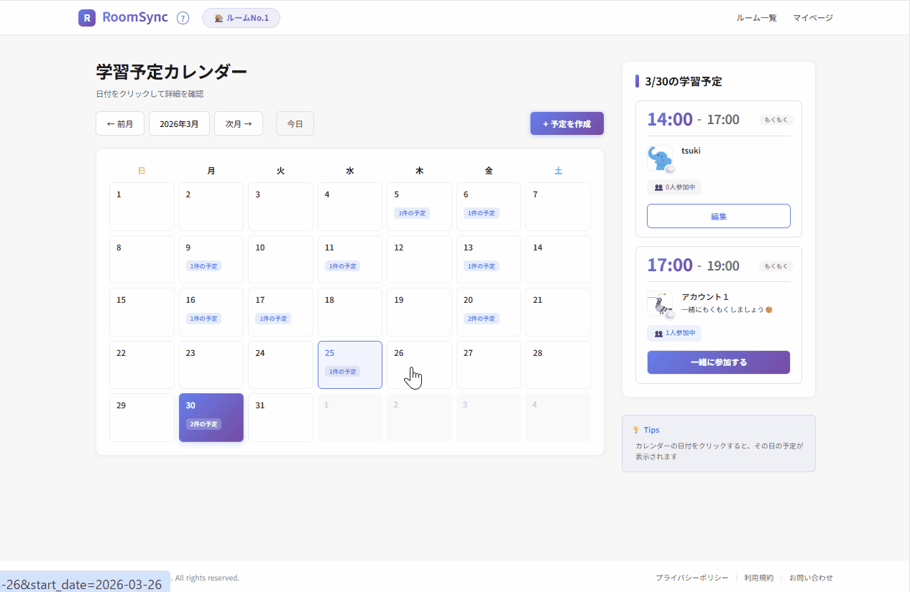
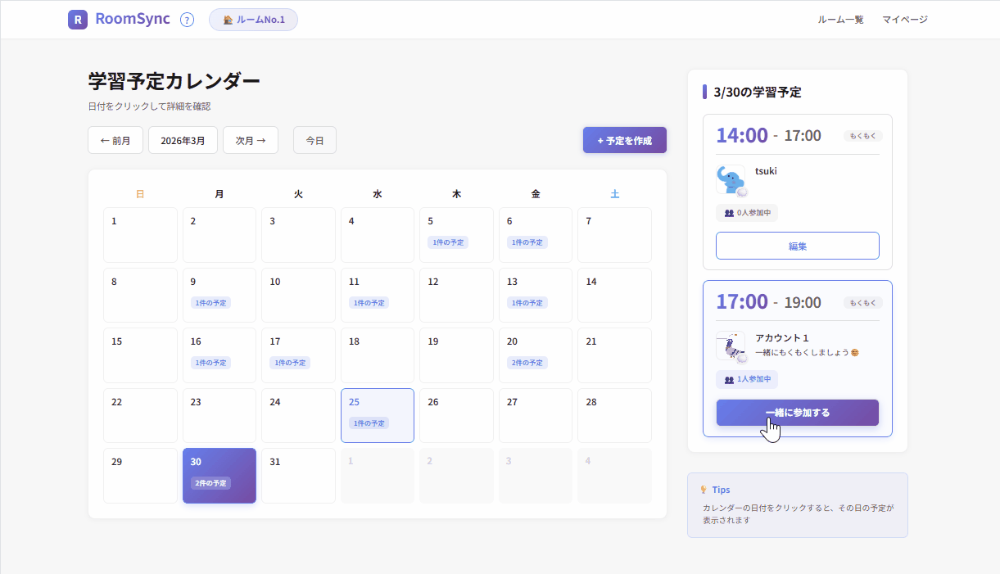
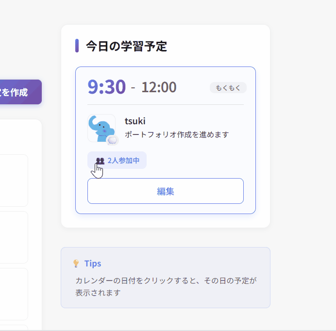
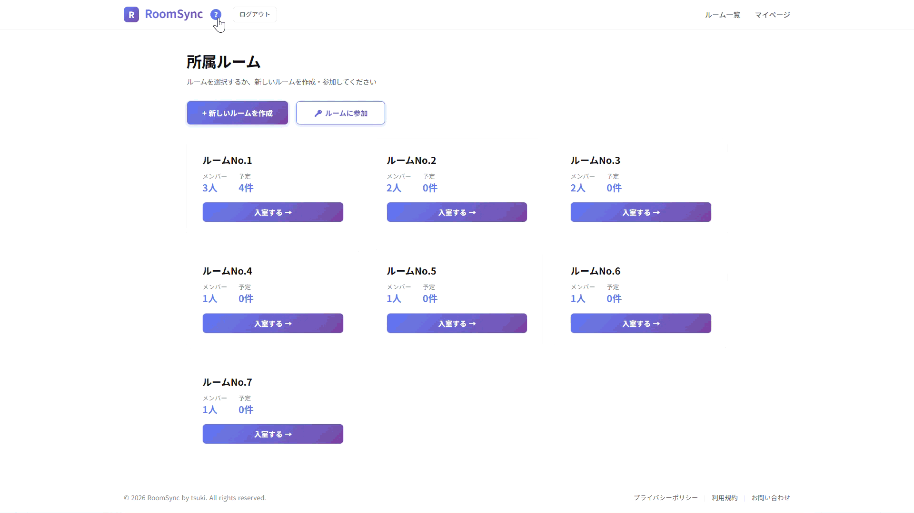

  

## 📖 サービス概要
RoomSyncは、オンライン学習の孤独を解消するための学習スケジュール共有プラットフォームです。  
カレンダーでオンライン学習室の入室予定を共有して、「一緒に参加」ボタンで気軽に学習仲間とつながることができます。

**🌐アプリURL**： https://roomsync-tsuki-5436df87bc23.herokuapp.com/  
> 💡**Tip** ゲストログインでユーザー登録なしでアプリの使用感を体験できます

#### コンセプト
「話さなくても、頑張りが見える。気軽につながる学習環境づくり」

#### 想定ユーザー
- プログラミングスクール受講生
- 独学で挫折しそうな初学者
- もくもく会を気軽に開催したい人

#### 提供したいこと
- オンライン学習の孤独な学習環境を解消し、モチベーションを高め合える場所を提供する
- 利用状況をオープンにすることでオンライン学習室への入室ハードルを下げる
- 学習者同士がもくもく会を気軽に開催するきっかけに

 

## 💭 制作背景
孤独なオンラインでの学習中、「誰かが今同じように頑張っている」と知るだけで、自分も頑張ろう！とモチベーションが湧いてくることがあります。しかし、自身の経験から、「一緒に勉強しませんか？」と自ら発信することにハードルの高さを感じる人も少なくないのではないかと考えていました。

RoomSyncは、**学習予定を共有し、気軽に参加し合える仕組み**を通じて交流のハードルを下げ、**オンライン学習の孤独感を軽減する**ことを目的に開発しました。

> - 自分から誘うのは緊張するけれど、予定をカレンダーに登録くらいならできそう  
> - あの人毎日頑張っているなあ。自分も今日は参加してみよう  
> - やる気がでないけど、この人も参加してくれているからもう少し続けよう！

本アプリを通じて、「**直接話しかけなくても、どこかで誰かが一緒に頑張っている**」という心地よい距離感の中で、ユーザーが自然とモチベーションを高め合い、学習を継続できる場所を提供したいと考えています。

また、技術的な側面では、Ruby on Railsを用いてDB設計・CRUD実装・UI/UX設計・テスト・デプロイといったWeb開発の一連のプロセスを形にすることも目的としています。

 

## 🖼️ 使用イメージ

  

 

**[その他使用イメージ](docs/manual/page_image.md)**

 

## 🔔 機能一覧

### 基本機能
|機能|詳細|
|---|---|
|ユーザー認証| Deviseによる安全な認証システム |
|ゲストログイン| ユーザー登録なしでアプリの使用感を体験 |
|ルーム管理| プライベートな学習ルームの作成・参加 |
|スケジュール作成| 学習予定のCRUD操作 |
|カレンダー表示| 月間カレンダーでルーム内の予定を可視化 |
|一緒に参加| ワンクリックで他のユーザーの予定に参加 |

### その他
**交流促進機能**
- **プロフィール機能** - アバター、名前、自己紹介、選択コース、SNSアカウント
- **つぶやき機能** - 最近の話題や目標、悩みなどを共有（アバター横に表示）

**セキュリティ機能**
- **ルームキー認証** - パスワードをハッシュ化した安全なルーム管理
- **プライバシー保護** - ルーム単位でのデータ分離

 

## ⚙️ 主な使用技術
- **開発環境** : Windows Subsystem for Linux (WSL2) / Ubuntu
- **バックエンド** : Ruby 3.3.2, Ruby on Rails Rails 7.2.3
- **フロントエンド** : Haml, SCSS(Dart Sass), Hotwire (Turbo + Stimulus)
- **インフラ・DB** : Heroku / AWS(S3), PostgreSQL 16.13
- **テスト** : RSpec, FactoryBot, Faker
- **その他** :
  - Git, GitHub(バージョン管理)
  - rubocop(リンタ―)
  - devise(ユーザー認証)
  - bullet(N+1問題対策)
  - bcrypt(ルームキーハッシュ化)
  - simple_calendar(カレンダー表示)

 

## 💻 データベース設計（ER図）

※ すべてのテーブルに Rails 標準の timestamps (created_at, updated_at) を含みます。  
※ 認証機能はdeviseを使用しています。(パスワード再設定機能は現段階では未実装)

 

## 💡 実装で意識した点

#### 保守性を意識した設計
- RESTfulな設計とDRY原則に沿ったコード整理
- SCSS変数管理とコンポーネント単位のディレクトリ構成で、デザインの一貫性を確保

#### パフォーマンス
- 適切なインデックス設計でクエリ速度を向上
- BulletによるN+1問題の検出・改善

#### セキュリティ
- Deviseによる安全な認証と適切な権限管理
- bcryptでルームキーをハッシュ化し、プライベートなルーム空間を保護

#### コード品質
- 表示ロジックをDecoratorsやHelpersへ分離し、ModelとViewの肥大化を防止
- 過去の予約防止や重複予約防止など、データの整合性を保つバリデーションを設定

#### テスト
- システムの信頼性を担保するためにモデルスペックを重点的に実装  
  ：特に、アプリの根幹である「ルーム管理」と「予定機能」において、複雑なバリデーションやロジックの網羅に注力しました。

  **ルーム機能**
  - 一意性・文字数制限
  - ルームキー認証ロジックの検証

  **予定機能**
  - 時間軸の妥当性
  - 入力値の正規化（15分単位・24時間以内）
  - 予定の重複の防止

#### UI/UXの向上
- Hotwireによるシームレスな操作感の実現（カレンダー・予定参加機能、つぶやき・参加者一覧の表示）
- 初めてのユーザーの迷子を防ぐヘルプをヘッダーに設置
- simple_calendarで直感的な予定管理を実現
- 統一されたデザインシステムで一貫性のあるUI

デモ動画

|カレンダー|
|---|
||

|予定参加|
|---|
||

|つぶやき・参加者表示|
|---|
||

|ユーザーヘルプ|
|---|
||

#### 開発プロセス
- feat:, fix: などのプレフィックスを用い、追いやすいコミット履歴を維持
- 概要・変更内容を明確に記載し、読みやすいPRを意識

 

## 📝 今後実装予定の機能

現在も継続的に機能のアップデートを行っております🐤

- マイページのリアルタイム通知機能
- 掲示板機能（もくもく会などのイベントの企画などが行える）
- スケジュールのタグと検索機能

 

開発ロードマップ🚩

### Phase 1 (完了)
- [x] ユーザー認証
- [x] プロフィール機能
- [x] ルーム機能
- [x] スケジュールCRUD
- [x] カレンダー表示
- [x] 一緒に参加機能

### Phase 2 (現在)
- [x] つぶやき表示機能
- [ ] マイページ通知
- [ ] メール通知
- [ ] スケジュールのタグと検索機能

### Phase 3 (予定)
- [ ] ルームの招待リンク機能
- [ ] 掲示板機能
- [ ] 予定のXシェア機能
- [ ] ルームのメンバー管理機能

### Phase 4 (将来)
- [ ] パフォーマンス向上
- [ ] CI/CD
- [ ] Docker対応

 

## 🖊️ おわりに
このプロジェクトはポートフォリオ用の個人プロジェクトです。  
Ruby on Rails学習のアウトプットとして、本リポジトリを公開させていただきました。  
今後も改善を続けていきますので、アドバイスやフィードバックがございましたら[Xアカウント](https://x.com/Oa_oden)までご連絡いただけますと幸いです。

作成者：**tsuki**

