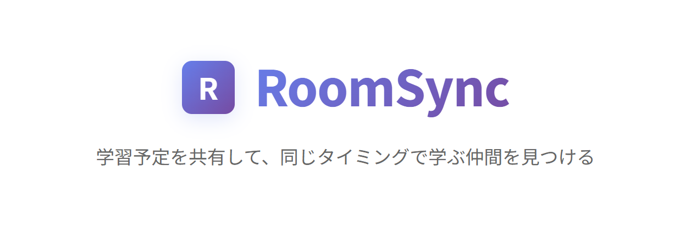
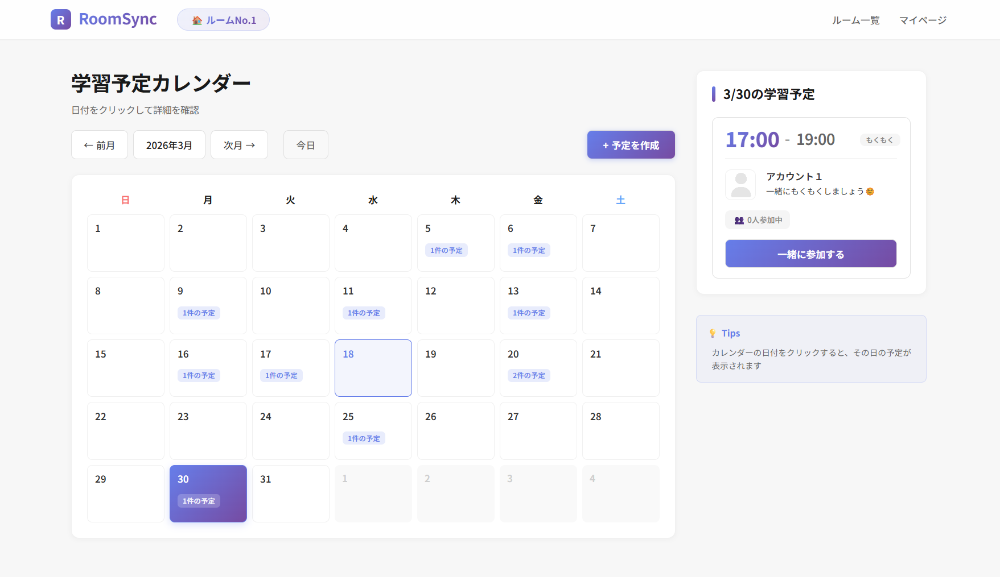
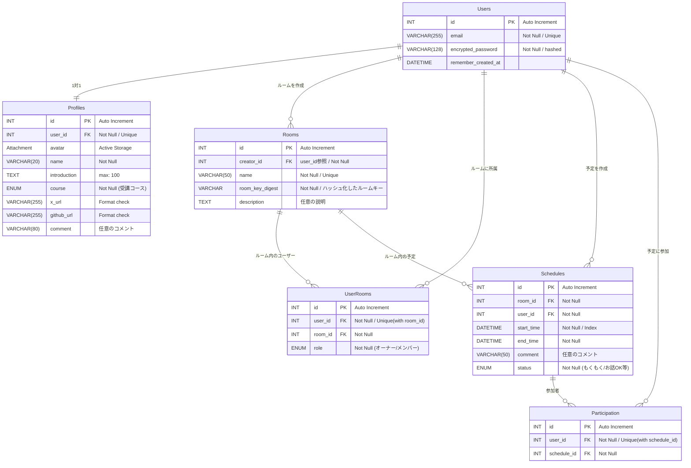

> [!IMPORTANT]
本アプリは現在ポートフォリオとして制作中のため、一部未実装の機能や調整中の箇所がございます。  
完成に向けて日々アップデートを継続しております。
>

  

## 📖 サービス概要
RoomSyncは、オンライン学習の孤独を解消するための学習スケジュール共有プラットフォームです。  
カレンダーでオンライン学習室の入室予定を共有して、「一緒に参加」ボタンで気軽に学習仲間とつながることができます。

#### コンセプト
「話さなくても、頑張りが見える。気軽につながる学習環境づくり」

#### 想定ユーザー
- プログラミングスクール受講生
- 独学で挫折しそうな初学者
- もくもく会を気軽に開催したい人

#### 提供したいこと
- オンライン学習の孤独な学習環境を解消し、モチベーションを高め合える場所を提供する
- 利用状況をオープンにすることでオンライン学習室への入室ハードルを下げる
- 学習者同士がもくもく会を気軽に開催するきっかけづくり

## 💭 制作背景
オンラインで一人で学習していると、孤独を感じることがあります。  
「誰かと一緒に頑張りたい」と思っても、オンライン学習には交流のハードルがあります。

- 顔が見えない環境での心理的な障壁
- チャットでは自分から発言する勇気が必要
- SNSではアカウントを知らないと活動が見えない

そこで、**学習予定を共有し、気軽に参加し合える仕組み**を作ることで、「話しかけなくても、誰かがどこかで一緒に頑張っている」というほどよい距離感でモチベーションを高め合える場所を作りたいと思い、RoomSyncを開発しました。

また同時に開発を通じて、CRUD実装からUI/UX設計・デプロイまで、Web開発の一連のプロセスを経験することも目的としています。

## 🖼️ 使用イメージ

  

[使用イメージ詳細](docs/manual/page_image.md)

## 🔔 機能一覧

### 基本機能
|機能|詳細|
|---|---|
|ユーザー認証| Deviseによる安全な認証システム |
|ルーム管理| プライベートな学習ルームの作成・参加 |
|スケジュール作成| 学習予定のCRUD操作 |
|カレンダー表示| 月間カレンダーで予定を可視化 |
|一緒に参加| ワンクリックで他のユーザーの学習に参加 |

### その他
#### 交流促進機能
- **プロフィール機能** - アバター、自己紹介、SNSリンク
- **つぶやき機能** - 今の気持ちを共有

#### セキュリティ機能
- **ルームキー認証** - 安全なルーム参加システム
- **プライバシー保護** - ルーム単位でのデータ分離

## ⚙️ 主な使用技術
- **開発環境** : Windows Subsystem for Linux (WSL2) / Ubuntu
- **バックエンド** : Ruby 3.3.2, Ruby on Rails Rails 7.2.3
- **フロントエンド** : Haml, SCSS(Dart Sass)
- **インフラ・DB** : Heroku / AWS, PostgreSQL 15+ (予定)
- **その他** :
  - Git, GitHub(バージョン管理)
  - rubocop(リンタ―)
  - devise(ユーザー認証)
  - bullet(N+1クエリ検出)
  - bcrypt(ルームキーハッシュ化)
  - simple_calendar(カレンダー表示)

## 💻 データベース設計（ER図）

※ すべてのテーブルに Rails 標準の timestamps (created_at, updated_at) を含みます。  
※ 認証機能はdeviseを使用しています。(パスワード再設定機能は現段階では未実装)

## 💡 実装で意識した点

## 📝 今後実装予定の機能
- マイページのリアルタイム通知機能
- スケジュールのタグと検索機能
- 掲示板機能（もくもく会などのイベントの企画などが行える）

開発ロードマップ

### Phase 1 (完了)
- [x] ユーザー認証
- [x] プロフィール機能
- [x] ルーム機能
- [x] スケジュールCRUD
- [x] カレンダー表示
- [x] 一緒に参加機能

**※現在テスト、デプロイ作業にあたっています**

### Phase 2 (予定)
- [ ] マイページ通知
- [ ] メール通知
- [ ] つぶやき表示機能
- [ ] スケジュールのタグと検索機能

### Phase 3 (予定)
- [ ] ルームの招待リンク機能
- [ ] 掲示板機能
- [ ] 予定のXシェア機能
- [ ] ルームのメンバー管理機能

### Phase 4 (将来)
- [ ] パフォーマンス向上
- [ ] CI/CD
- [ ] Docker対応

## 🖊️ おわりに
このプロジェクトはポートフォリオ用の個人プロジェクトです。  
Ruby on Rails学習のアウトプットとして、本リポジトリを公開させていただきました。  
今後も改善を続けていきますので、アドバイスやフィードバックがございましたら[Xアカウント](https://x.com/Oa_oden)までご連絡いただけますと幸いです。

作成者：**tsuki**

