# 使用イメージ

## アプリTOP

  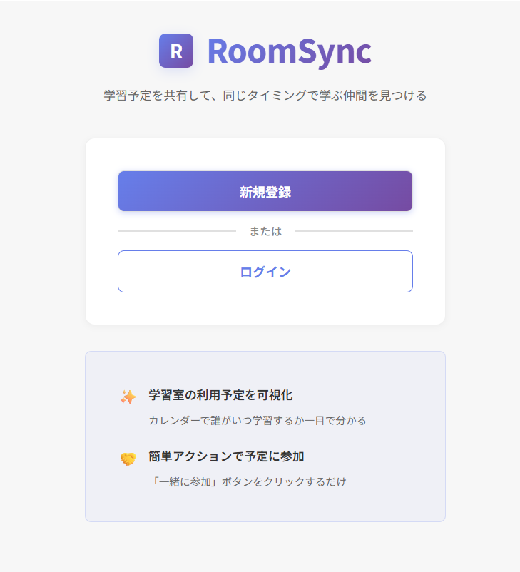

## ユーザー認証

  |新規登録|ログイン|
  |:---:|:--:|
  |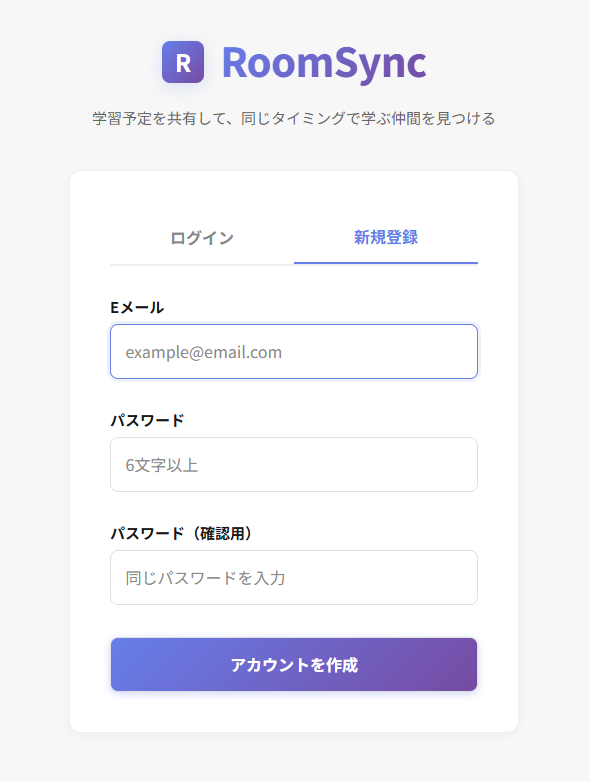|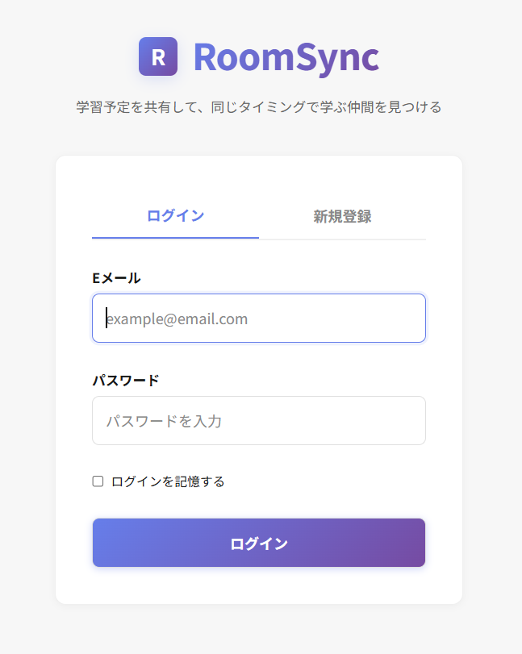|

## マイページ

  |マイページ/TOP|
  |:---:|
  |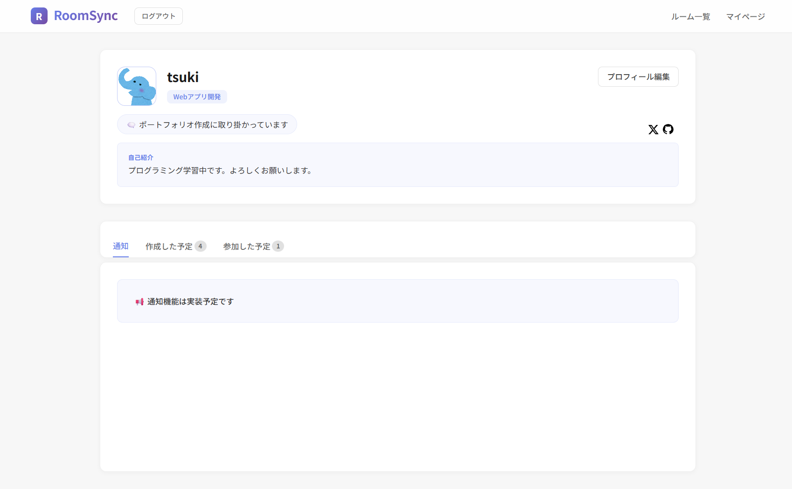|

  |マイページ/作成した予定一覧|
  |:---:|
  |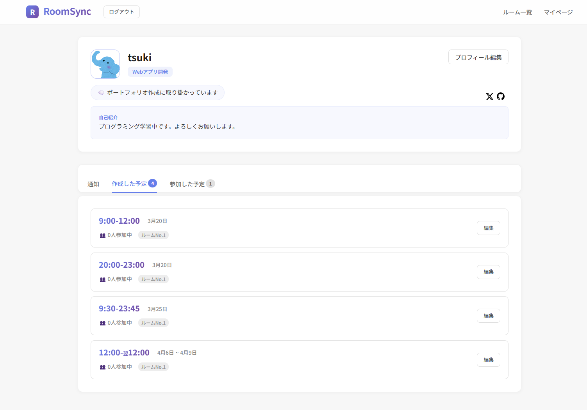|

  |マイページ/参加した予定一覧|
  |:---:|
  |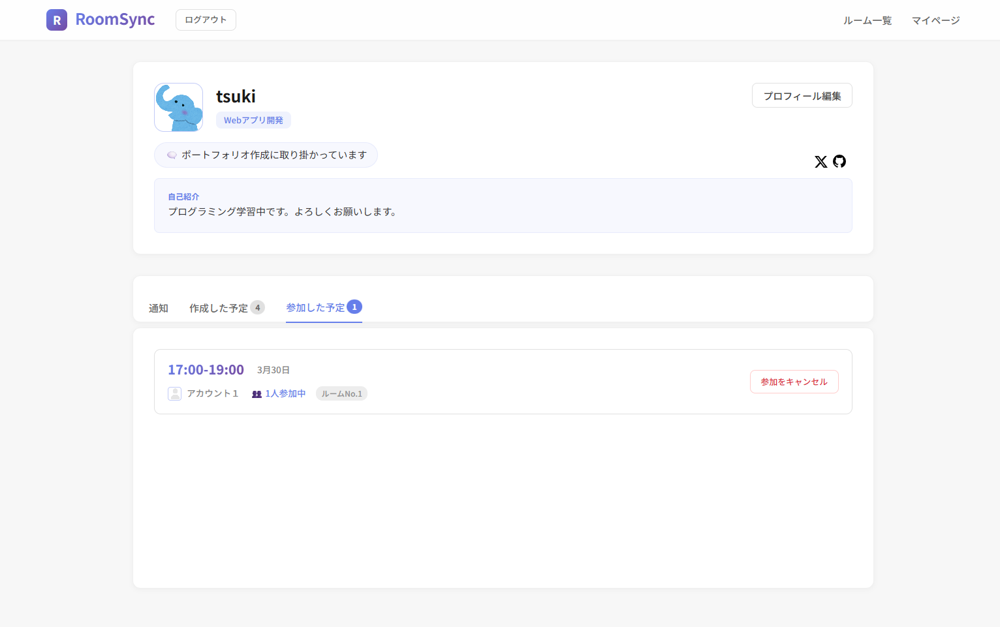|

  |プロフィール編集|
  |:---:|
  |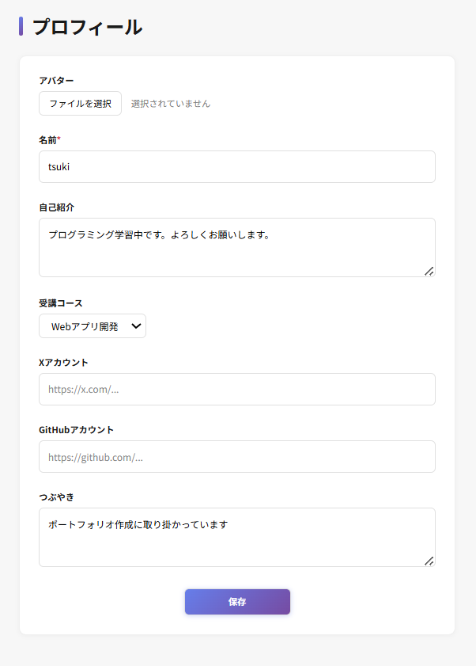|

## ルーム管理

  |マイルーム|
  |:---:|
  |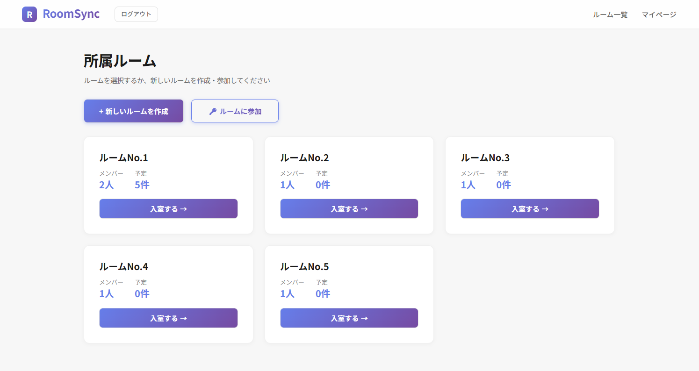|

  |ルーム作成|ルーム参加|
  |:---:|:--:|
  |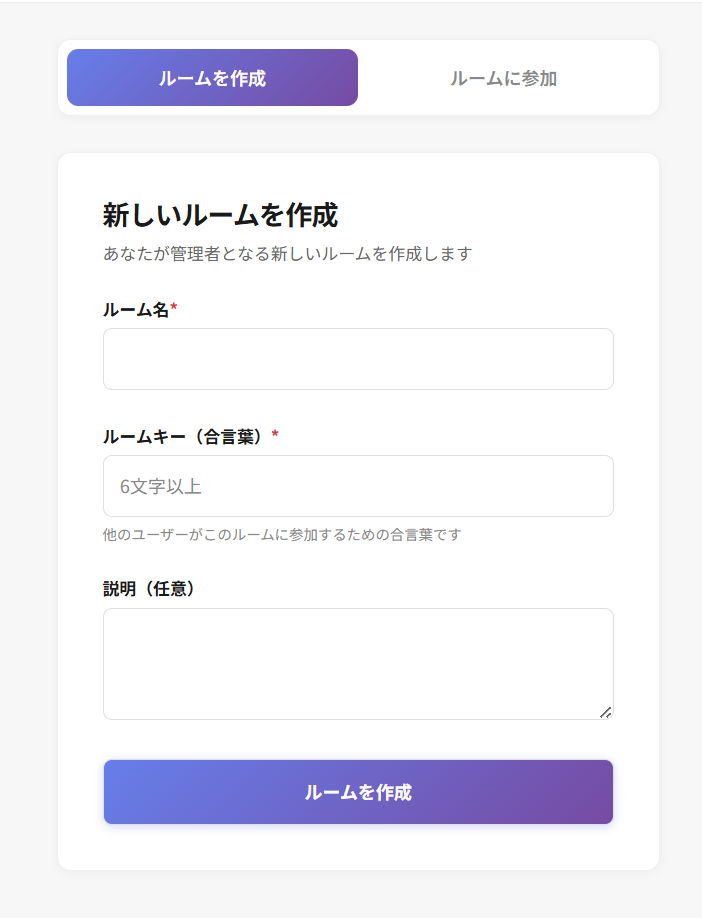|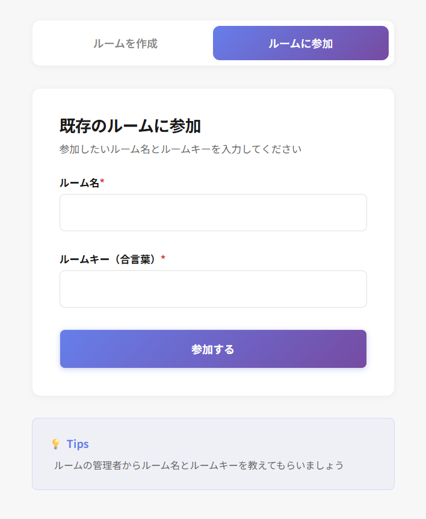|

## ルーム内

  |ルーム内カレンダー|
  |:---:|
  ||

  |予定作成|予定編集|
  |:---:|:--:|
  |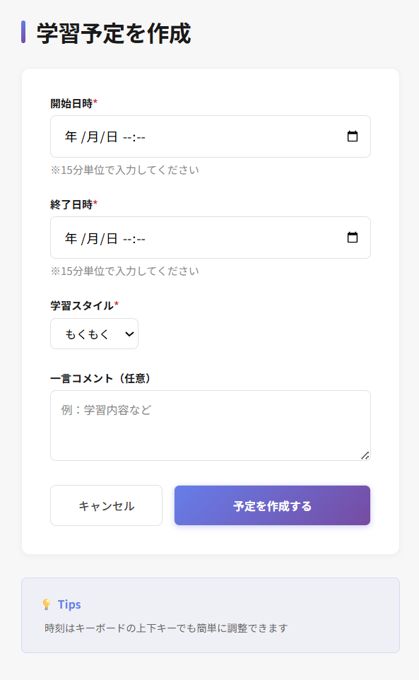|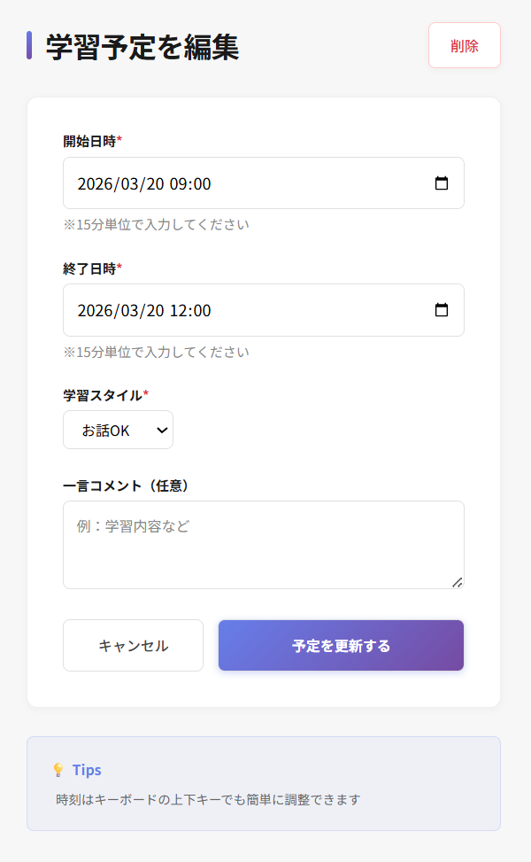|

|
